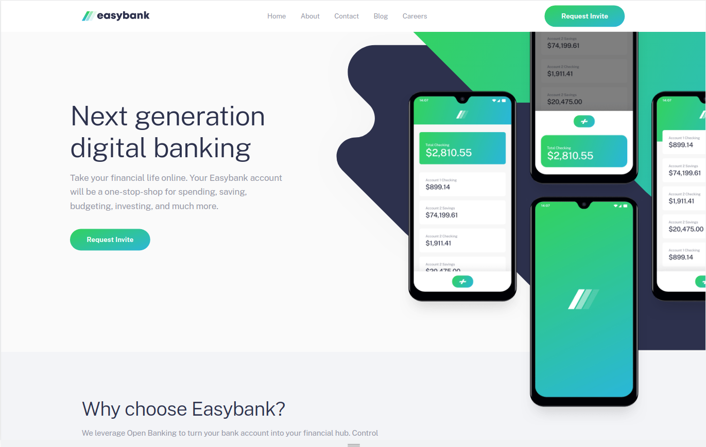

# Frontend Mentor - Easybank landing page solution

This is a solution to the [Easybank landing page challenge on Frontend Mentor](https://www.frontendmentor.io/challenges/easybank-landing-page-WaUhkoDN)

## Table of contents

- [Overview](#overview)
  - [Screenshot](#screenshot)
  - [Links](#links)
- [My process](#my-process)
  - [Built with](#built-with)
- [Author](#author)

## Overview

### Screenshot

### Links

- Solution URL: [https://github.com/markrajk/fm_easybak_landing_page](https://github.com/markrajk/fm_easybak_landing_page)
- Live Site URL: [https://markrajk.github.io/fm_easybak_landing_page/](https://markrajk.github.io/fm_easybak_landing_page/)

## My process

### Built with

- Semantic HTML5 markup
- SCSS
- Mobile-first workflow
- IcoMoon

## Author

- Website - [web-apprentice.com](https://www.web-apprentice.com/)
- Frontend Mentor - [@markrajk](https://www.frontendmentor.io/profile/markrajk)
